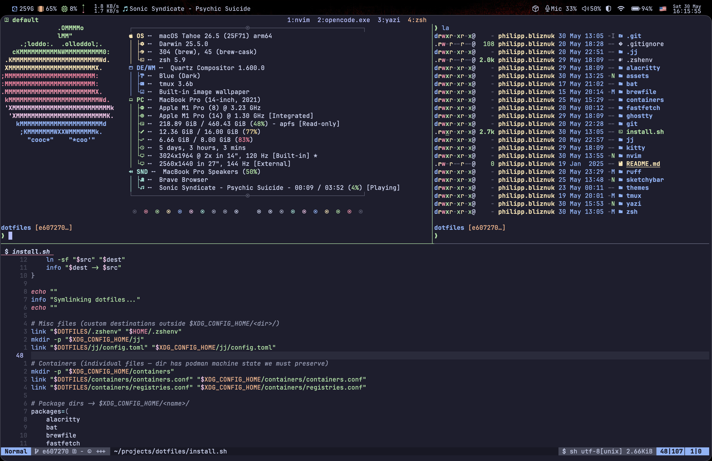
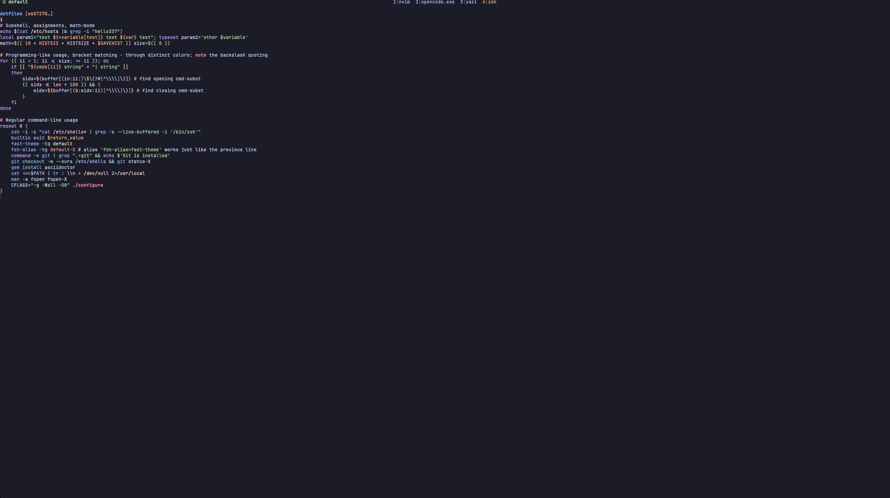
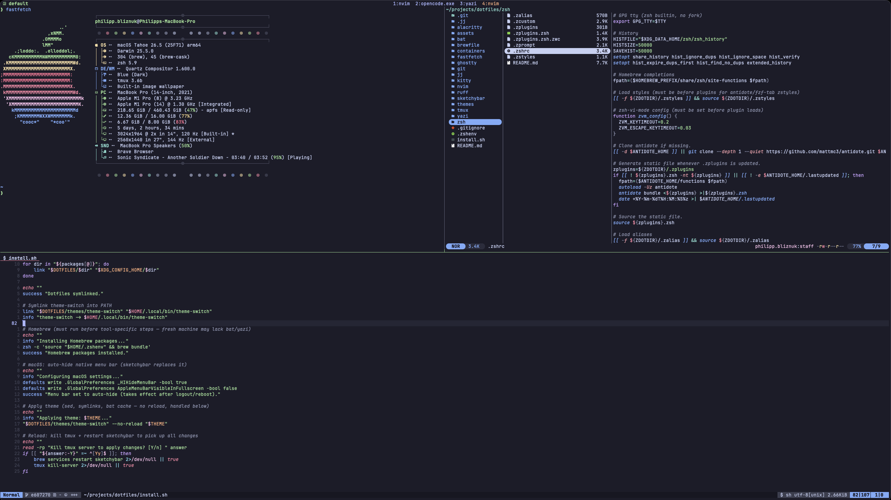

# Dotfiles



> These are my personal dotfiles. I maintain them for my own use and have no
> intention of providing support or backward compatibility. That said — you're
> welcome to fork, cherry-pick, or use any of this as inspiration for your own
> setup. If something here saves you an afternoon of research, it was worth
> publishing.

## Philosophy

This isn't a collection of configs that happen to live in the same repo. It's a
single ecosystem where every tool is aware of every other tool and they all speak
the same language.

**Core principles:**

- **One theme, everywhere** — a single `$THEME` variable in `.zshenv` propagates
  to terminal, shell prompt, tmux, nvim, zed, sketchybar, yazi, and bat. One
  command switches all 8+ apps simultaneously.
- **XDG compliance** — only `.zshenv` lives in `$HOME`. Everything else is under
  `~/.config/`.
- **Symlink simplicity** — one idempotent `install.sh`. No stow, no Nix, no
  Ansible. Plain `ln -sf` and done.
- **Performance-first shell** — zero forks in the prompt, deferred completions,
  evalcache, compiled plugins.
- **Vi-centric** — zsh vi-mode, tmux vi keys, nvim, yazi. Same muscle memory
  everywhere.
- **Privacy & sovereignty** — Brave + LibreWolf, GPG signing via TouchID, Podman
  over Docker, `HOMEBREW_NO_ANALYTICS=1`.

## Theming

All 8 themes map their palettes onto a normalized set of semantic color names
(catppuccin's vocabulary). Every consumer — prompt, fzf, tmux statusbar,
sketchybar, nvim — reads the same key names and gets correct colors regardless
of which theme is active.

**Supported themes:** catppuccin-mocha, tokyo-night, kanagawa, gruvbox-dark,
rose-pine, everforest, dracula, nord

**Switching:** `theme-switch <name>` updates `.zshenv`, rewrites terminal configs,
symlinks kitty/alacritty themes, rebuilds bat cache, updates Zed's theme, and
restarts sketchybar + tmux.

## What's Inside

| Directory     | Purpose                                           |
| ------------- | ------------------------------------------------- |
| `alacritty/`  | Alacritty terminal config (fallback)              |
| `bat/`        | Syntax-highlighted `cat` replacement              |
| `brewfile/`   | Homebrew package manifest                         |
| `containers/` | Podman/Buildah configuration                      |
| `fastfetch/`  | System info display                               |
| `ghostty/`    | Primary terminal (custom GLSL shaders)            |
| `git/`        | Git config, global ignore, delta pager            |
| `jj/`         | Jujutsu VCS (colocated with git)                  |
| `kitty/`      | Kitty terminal config (fallback)                  |
| `nvim/`       | Neovim IDE — [full documentation](nvim/README.md) |
| `ruff/`       | Python linter/formatter global config             |
| `sketchybar/` | macOS menu bar replacement                        |
| `themes/`     | 8 theme palettes + `theme-switch` script          |
| `tmux/`       | Terminal multiplexer                              |
| `yazi/`       | File manager                                      |
| `zed/`        | Zed editor (secondary GUI editor)                 |
| `zsh/`        | Shell configuration                               |

## Shell



Custom zsh setup built for speed. Pure-zsh prompt (~80 lines, no starship/p10k)
that reads `.git/HEAD` directly — zero subprocess forks. Antidote plugin manager
with deferred loading, evalcache for slow evals, compiled plugins.

**Key features:** vi-mode, transient prompt, auto-attach tmux,
fast-syntax-highlighting, fzf-tab, zoxide, deferred completions for heavy CLIs
(uv, jj, podman).

## Neovim


Purpose-built IDE for Python and web development on Neovim 0.12+. Uses native
`vim.pack` (no lazy.nvim), native LSP API (no lspconfig plugin), 27 plugins
total. 95ms startup, everything ready at first frame.

**Highlights:** 15 LSP servers, format on save (ruff, prettierd, stylua,
goimports), blink.cmp completion, fzf-lua picker, gitsigns, treesitter
textobjects, 8 colorschemes driven by `$THEME`.

See [nvim/README.md](nvim/README.md) for the full breakdown.

## Tmux



Prefix `C-s`, vi copy-mode, transparent status bar pulling colors from theme
environment variables. `prefix+g` opens lazygit in a 90% popup. Sessions persist
across restarts via resurrect + continuum.

## Zed

Secondary GUI editor for lighter sessions. Vim mode with space-leader bindings
mirroring the nvim keymap. Same LSP stack (basedpyright + ruff), same formatters
(prettierd, stylua, shfmt, goimports), same theme — `theme-switch` updates
`settings.json` via sed.

**Key features:** format on save per-language, fzf-style file finder, gitsigns
gutter, inline blame, vim surround/sneak built-in, project panel with vim keys.

## Installation

```bash
git clone https://github.com/philipp-bliznuk/dotfiles ~/projects/dotfiles
cd ~/projects/dotfiles
./install.sh
```

The script symlinks everything, installs Homebrew packages, applies the active
theme, and optionally restarts tmux + sketchybar.

**Requirements:**

- macOS (Apple Silicon)
- Homebrew
- Neovim 0.12+
- JetBrains Mono Nerd Font (installed via Brewfile)

## License

MIT
