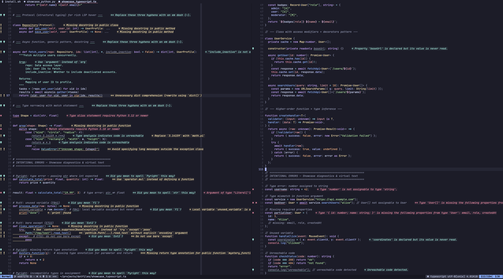
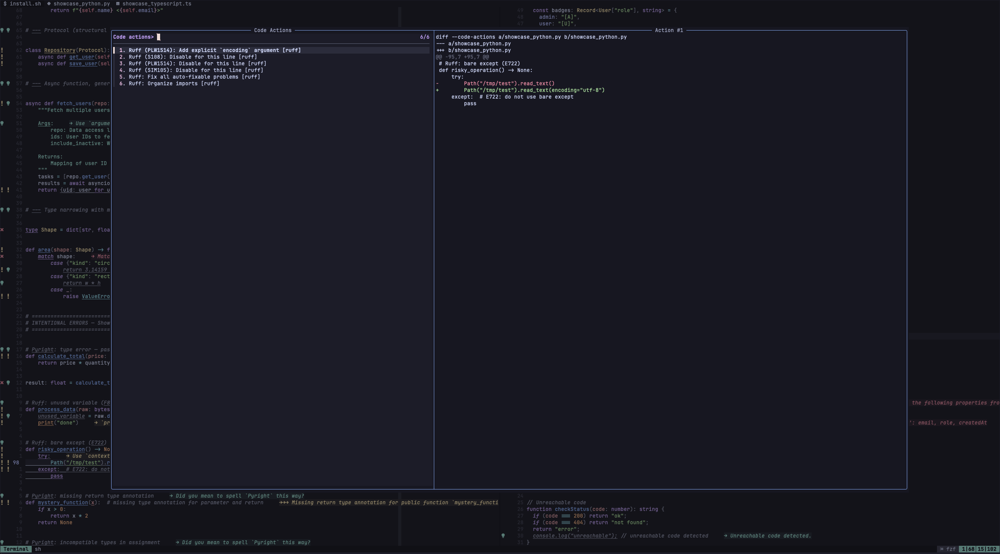
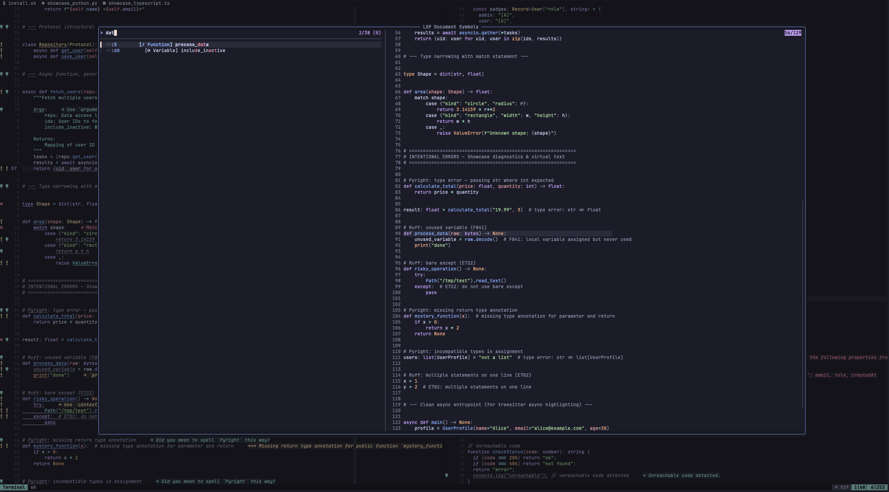
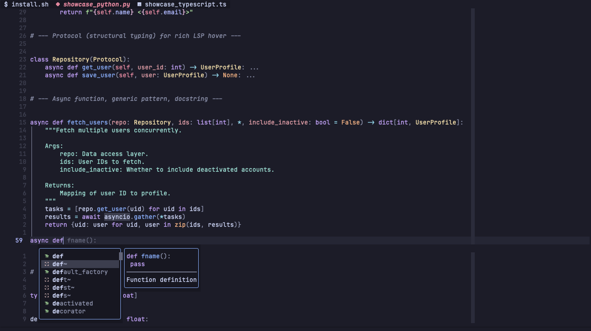
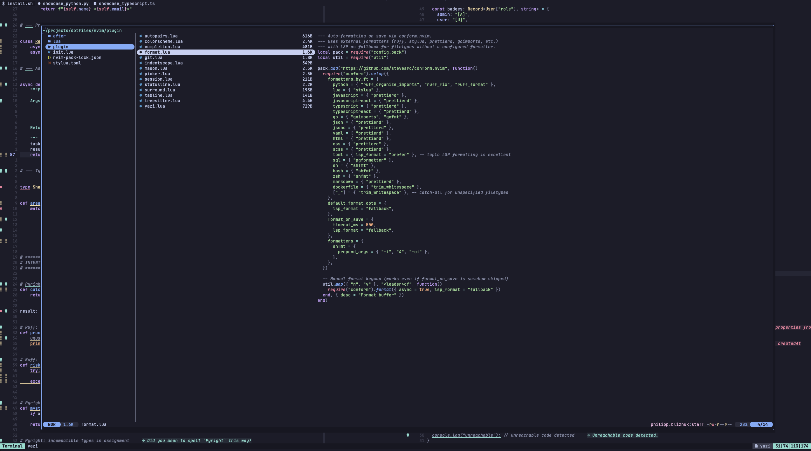

# Neovim Configuration

Purpose-built IDE for Python and web development on Neovim 0.12+.



## Philosophy

This config is built from the ground up with a clear priority order:

1. **Functionality** — every feature an IDE needs, nothing more
2. **Performance** — 95ms bare startup, everything ready at first frame
3. **Aesthetic** — consistent theming driven by a single `$THEME` env var

Core principles:

- **Native first** — uses `vim.pack` (built-in plugin manager), `vim.lsp.config()` + `vim.lsp.enable()` (native LSP), `vim.treesitter` APIs
- **Zero framework** — no lazy.nvim, no lspconfig plugin, no nvim-treesitter module. Direct control over every moving part
- **Self-contained** — Mason auto-installs all 20 tools on first launch. Open nvim, wait 30 seconds, everything works
- **Opinionated** — format on save (always), leader-based keymaps, explicit clipboard, vi-centric everywhere

## Features

- **15 LSP servers** — Python (basedpyright + ruff), TypeScript (tsgo), Go (gopls), Lua, JSON, YAML, HTML, CSS, TOML, SQL, Docker, Bash, plus grammar/spell checking (harper-ls, typos-lsp)
- **Format on save** — ruff (Python), prettierd (JS/TS/HTML/CSS/JSON/YAML/Markdown), stylua (Lua), goimports + gofmt (Go), shfmt (Shell), pgformatter (SQL)
- **Completion** — blink.cmp v1 with LSP, buffer, path, snippets, and cmdline sources. Rust fuzzy matcher, ghost text, signature help
- **Fuzzy picker** — fzf-lua for files, grep, symbols, commands, keymaps, git, code actions, spell suggestions. Inherits system `FZF_DEFAULT_OPTS`
- **Git** — gitsigns (gutter signs, hunk staging/reset, inline blame, diff) + lazygit via tmux popup
- **Treesitter** — arborist.nvim for parser management, textobjects (`af/if/ac/ic/aa/ia`), sticky context header, autotag for HTML/JSX
- **Session** — auto-save on quit, auto-restore on bare `nvim`
- **8 colorschemes** — catppuccin, tokyonight, kanagawa, gruvbox, rose-pine, everforest, dracula, nord. Applied from `$THEME` env var on startup
- **File explorer** — yazi.nvim with LSP-aware rename/move (auto-updates imports)

## Screenshots

### Code Actions via Fuzzy Picker



### Document Symbols



### Autocompletion



### File Explorer (Yazi)



## Key Decisions

| Decision                           | Reasoning                                                                                |
| ---------------------------------- | ---------------------------------------------------------------------------------------- |
| `vim.pack` over lazy.nvim          | Native, zero dependencies, lockfile, forward-looking                                     |
| Mason only (no mason-lspconfig)    | One plugin for install + registry API for auto-install. No middleware.                   |
| Inline `vim.lsp.config[]`          | All 15 server configs in one file. No lspconfig plugin needed.                           |
| arborist.nvim over nvim-treesitter | Archived upstream. Arborist: auto-install parsers, bundled queries, actively maintained. |
| fzf-lua over telescope             | Telescope unmaintained (452 issues). fzf-lua: fastest, 8 issues, leverages system fzf.   |
| conform.nvim for formatting        | Sequencing (ruff: organize + fix + format), external tools + LSP fallback, minimal-diff. |
| blink.cmp v1 over nvim-cmp         | Rust fuzzy matcher, built-in cmdline, 0.5-4ms async, community standard.                 |
| mini.nvim family for UI            | Consistent ecosystem: tabline, statusline, icons, indentscope, surround.                 |
| Explicit clipboard                 | No `clipboard=unnamedplus`. System clipboard via `<leader>y/Y/P` only.                   |

## Plugins

| Plugin                          | Purpose                             | Load Strategy               |
| ------------------------------- | ----------------------------------- | --------------------------- |
| **mason.nvim**                  | LSP/formatter/DAP installer         | Eager (PATH needed for LSP) |
| **arborist.nvim**               | Treesitter parser management        | Eager                       |
| **nvim-treesitter-context**     | Sticky function/class header        | Eager                       |
| **nvim-treesitter-textobjects** | `af/if/ac/ic/aa/ia` + `]f/[f/]c/[c` | Eager                       |
| **nvim-ts-autotag**             | Auto-close/rename HTML/JSX tags     | On filetype                 |
| **blink.cmp** (v1)              | Completion engine                   | Eager (before LSP)          |
| **friendly-snippets**           | Snippet collection                  | Eager                       |
| **conform.nvim**                | Format on save                      | Eager                       |
| **nvim-autopairs**              | Auto-close brackets/quotes          | On InsertEnter              |
| **fzf-lua**                     | Fuzzy picker for everything         | Eager                       |
| **plenary.nvim**                | Utility library (yazi dep)          | Eager                       |
| **yazi.nvim**                   | File explorer                       | Eager                       |
| **auto-session**                | Session save/restore                | Eager                       |
| **gitsigns.nvim**               | Git gutter + hunk ops + blame       | On UIEnter                  |
| **mini.tabline**                | Buffer tab bar                      | Eager                       |
| **mini.statusline**             | Statusline                          | Eager                       |
| **mini.icons**                  | Filetype icons                      | Eager                       |
| **mini.indentscope**            | Scope indent guide                  | On BufReadPost              |
| **mini.surround**               | Add/delete/change surroundings      | On BufReadPost              |
| **catppuccin/nvim**             | Colorscheme (or whichever $THEME)   | Eager (only active theme)   |

## LSP Servers

| Server       | Languages      | Notes                                                                     |
| ------------ | -------------- | ------------------------------------------------------------------------- |
| basedpyright | Python         | Type checking, auto-import, inlay hints, venv detection via `vim.fs.root` |
| ruff         | Python         | Linting + formatting (hover disabled, defers to basedpyright)             |
| lua_ls       | Lua            | Neovim runtime libs, LuaJIT, diagnostics.globals = vim                    |
| tsgo         | JS/TS/JSX/TSX  | Microsoft's Go-based TS server, lockfile-first root detection             |
| gopls        | Go             | Analyses, staticcheck, gofumpt, inlay hints                               |
| jsonls       | JSON/JSONC     | Schema validation                                                         |
| yamlls       | YAML           | Kubernetes/docker-compose schema support                                  |
| html         | HTML           | Completions, hover, formatting                                            |
| cssls        | CSS/SCSS/Less  | Completions, color preview                                                |
| taplo        | TOML           | Validation, formatting, pyproject.toml schema                             |
| postgres_lsp | SQL            | PostgreSQL-native parser (libpg_query)                                    |
| dockerls     | Dockerfile     | Containerfile support via filetype mapping                                |
| bashls       | Bash/Shell     | ShellCheck integration                                                    |
| harper_ls    | All code files | Grammar + spell checking in comments/strings                              |
| typos_lsp    | All files      | Common misspelling detection in identifiers                               |

## Keymaps

Leader key: `Space`

### General

| Key               | Mode | Action                            |
| ----------------- | ---- | --------------------------------- |
| `<Esc>`           | n    | Clear search highlight            |
| `x`               | n    | Delete char (no yank)             |
| `J`               | n    | Join lines (keep cursor position) |
| `<C-d>` / `<C-u>` | n    | Half-page scroll (centered)       |
| `n` / `N`         | n    | Next/prev search match (centered) |
| `J` / `K`         | v    | Move selection down/up            |
| `<A-j>` / `<A-k>` | n    | Move line down/up                 |
| `<` / `>`         | v    | Indent (stay in visual mode)      |
| `Q`               | n    | Disabled                          |

### Leader

| Key                        | Mode | Action                            |
| -------------------------- | ---- | --------------------------------- |
| `<leader>w`                | n    | Save file                         |
| `<leader>d`                | n, v | Delete to void register           |
| `<leader>p`                | x    | Paste without losing register     |
| `<leader>y` / `<leader>Y`  | n, v | Yank to system clipboard          |
| `<leader>P`                | n, v | Paste from system clipboard       |
| `<leader>sr`               | n, x | Search and replace word/selection |
| `<leader>-` / `<leader>\|` | n    | Split horizontal / vertical       |
| `<leader>bd`               | n    | Delete buffer                     |
| `<leader>bo`               | n    | Close other buffers               |
| `<leader>bl`               | n    | Switch to last buffer             |
| `<leader>e`                | n    | Show diagnostic float             |
| `<leader>q`                | n    | Diagnostics to loclist            |
| `<leader>u`                | n    | Undotree (built-in 0.12)          |
| `<leader>cf`               | n, v | Format buffer (manual)            |
| `<leader>pu`               | n    | Update all plugins                |

### Fuzzy Picker (`<leader>f`)

| Key          | Action                        |
| ------------ | ----------------------------- |
| `<leader>ff` | Find files                    |
| `<leader>fg` | Grep word under cursor        |
| `<leader>/`  | Live grep                     |
| `<leader>f/` | Search current buffer         |
| `<leader>fb` | Buffers (sorted by last used) |
| `<leader>f.` | Recent files (project only)   |
| `<leader>fh` | Help tags                     |
| `<leader>fk` | Keymaps                       |
| `<leader>fc` | Commands                      |
| `<leader>fr` | Resume last picker            |

### LSP (`<leader>g`)

| Key          | Action                        |
| ------------ | ----------------------------- |
| `<leader>gd` | Go to definition              |
| `<leader>gD` | Go to declaration             |
| `<leader>gr` | Find references               |
| `<leader>gi` | Go to implementation          |
| `<leader>gy` | Type definition               |
| `<leader>gs` | Document symbols              |
| `<leader>gw` | Workspace symbols (live)      |
| `<leader>gx` | Workspace diagnostics         |
| `<leader>ih` | Toggle inlay hints            |
| `K`          | Hover documentation (default) |
| `gra`        | Code action (default)         |
| `grn`        | Rename (default)              |

### Git (`<leader>h`)

| Key          | Action                    |
| ------------ | ------------------------- |
| `]h` / `[h`  | Next/prev hunk            |
| `<leader>hs` | Stage hunk                |
| `<leader>hS` | Stage buffer              |
| `<leader>hr` | Reset hunk                |
| `<leader>hR` | Reset buffer              |
| `<leader>hu` | Undo stage hunk           |
| `<leader>hp` | Preview hunk inline       |
| `<leader>hb` | Blame line (popup)        |
| `<leader>hB` | Toggle inline blame       |
| `<leader>hd` | Diff against index        |
| `ih`         | Select hunk (text object) |
| `<leader>gb` | Git branches (picker)     |
| `<leader>gl` | Git log (picker)          |
| `<leader>gS` | Git status (picker)       |

### Treesitter Textobjects

| Key          | Mode    | Action                                 |
| ------------ | ------- | -------------------------------------- |
| `af` / `if`  | x, o    | Select around/inside function          |
| `ac` / `ic`  | x, o    | Select around/inside class             |
| `aa` / `ia`  | x, o    | Select around/inside argument          |
| `]f` / `[f`  | n, x, o | Next/prev function start               |
| `]F` / `[F`  | n, x, o | Next/prev function end                 |
| `]c` / `[c`  | n, x, o | Next/prev class start (or diff change) |
| `<leader>tc` | n       | Toggle treesitter context              |

### Surround (mini.surround)

| Key  | Action              |
| ---- | ------------------- |
| `sa` | Add surrounding     |
| `sd` | Delete surrounding  |
| `sr` | Replace surrounding |

### Navigation

| Key                      | Action                           |
| ------------------------ | -------------------------------- |
| `<C-h/j/k/l>`            | Window navigation                |
| `<C-Up/Down/Left/Right>` | Window resize                    |
| `[b` / `]b`              | Previous/next buffer             |
| `[d` / `]d`              | Previous/next diagnostic         |
| `[q` / `]q`              | Previous/next quickfix           |
| `<leader>ec`             | Explore current directory (yazi) |
| `<leader>ep`             | Explore project root (yazi)      |
| `z=`                     | Spell suggestions (picker)       |

## Colorschemes

Active theme reads from `$THEME` environment variable (set in `.zshenv`, propagated by `theme-switch` script). Only the active theme plugin is loaded at startup — others remain installed but not sourced.

Supported values: `catppuccin-mocha`, `tokyo-night`, `kanagawa`, `gruvbox-dark`, `rose-pine`, `everforest`, `dracula`, `nord`

## Requirements

- **Neovim 0.12+**
- **fzf** — fuzzy finder binary (picker backend)
- **fd** — file finder (used by fzf-lua)
- **ripgrep** — grep tool (used by fzf-lua + grepprg)
- **tree-sitter** CLI — parser compilation (used by arborist)
- **JetBrains Mono Nerd Font** — glyphs for diagnostics, git signs, icons

All LSP servers and formatters are managed by Mason — no manual installation needed.

## Installation

Part of the [dotfiles](../) repo. Symlinked via `install.sh`:

```bash
ln -sf ~/projects/dotfiles/nvim ~/.config/nvim
```

First launch installs all plugins (vim.pack) and tools (Mason) automatically. No restart required.

## Performance

| Metric                               | Time                                            |
| ------------------------------------ | ----------------------------------------------- |
| Bare startup (no file)               | **95ms**                                        |
| Python file (LSP + treesitter ready) | **~140ms** input-ready, ~380ms full diagnostics |

Measured with `nvim --startuptime`. The ~240ms async tail is LSP server analysis (basedpyright type graph, ruff linting) — doesn't block input.
