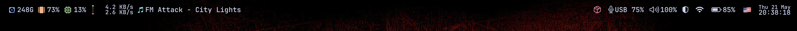
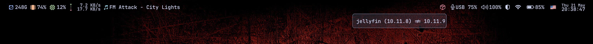

# Sketchybar

Minimal, themed status bar for macOS replacing the native menu bar. Displays system metrics on the left, utilities on the right. Fully integrated with the global theme system.

## Screenshots

### Bar Overview



### Brew Hover Popup



## File Structure

```
sketchybar/
├── sketchybarrc          # Entry point: bar config, item loading
├── colors.sh             # Runtime theme parser (reads from themes/$THEME/)
├── settings.sh           # Font, padding, defaults, popup helper
├── items/                # Item definitions (position, frequency, icon)
│   ├── battery.sh
│   ├── brew.sh
│   ├── cpu.sh
│   ├── datetime.sh
│   ├── disk.sh
│   ├── input.sh
│   ├── media.sh
│   ├── network.sh
│   ├── network_rates.sh
│   ├── ram.sh
│   └── sound.sh
└── plugins/              # Scripts executed by items on trigger/interval
    ├── battery.sh
    ├── brew.sh
    ├── cpu.sh
    ├── disk.sh
    ├── input.sh
    ├── media.sh
    ├── mic.sh
    ├── network_rates.sh
    ├── ram.sh
    ├── volume.sh
    ├── vpn.sh
    └── wifi.sh
```

## Features

- **Dynamic theming** — `colors.sh` self-parses `THEME` from `.zshenv` at runtime and loads hex values from `~/.config/themes/$THEME/theme.zsh`. No install-time dependency.
- **Poll-based media** — `media-control get` every 1s. No background daemons. Never toggles `drawing` state (avoids WindowServer render caching bug).
- **Performant plugins** — CPU via `ps`+awk (instant), RAM via `vm_stat` (instant), network rates via file-based delta (no `sleep`), VPN via `mullvad status` CLI (no curl).
- **Brew management** — Hover popup shows outdated packages, click to upgrade. Lockfile prevents concurrent processes.
- **Hot-reload** — `hotload on` enables live config changes during development.

## Layout

| Left | Right |
|------|-------|
| Disk, RAM, CPU, Network rates, Media | Brew, Mic, Volume, VPN, WiFi, Battery, Input language, Datetime |

## Dependencies

- [sketchybar](https://github.com/FelixKratz/SketchyBar)
- [media-control](https://formulae.brew.sh/formula/media-control) (now-playing polling)
- [SwitchAudioSource](https://formulae.brew.sh/formula/switchaudio-osx) (mic/audio)
- JetBrainsMono Nerd Font
