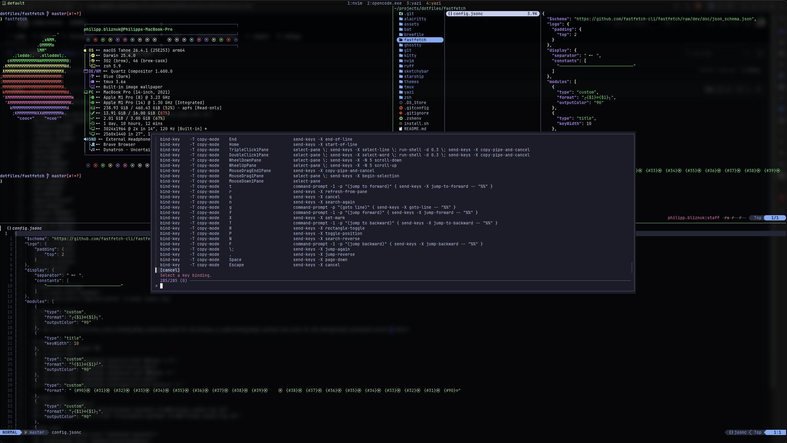

# Tmux Configuration

A minimal tmux setup with vim-style navigation, session persistence, and
theme colors pulled directly from the global `THEME_COLORS` environment
variables — no per-theme config files needed.

## Philosophy

1. **Env-driven theming** — tmux reads `$THEME_*` env vars exported by
   `.zshrc`. Theme changes propagate by restarting the tmux server.
2. **Session persistence** — tmux-resurrect + tmux-continuum auto-save every
   15 minutes. Restored panes spawn fresh shells (no zombie processes).
3. **Vim everywhere** — pane navigation with hjkl, copy mode with vi bindings,
   resize with Shift+hjkl.
4. **Minimal chrome** — transparent background, centered window list, session
   indicator only. No status-right clutter.

## File Structure

```
~/.config/tmux/
  tmux.conf     Single config file (settings, binds, plugins, themed styles)
```

No theme subdirectories — all colors come from environment.

## Theming

Colors are read from env vars at config parse time:

| Var | Used for |
|-----|----------|
| `$THEME_GREEN` | Active pane border, session indicator (normal) |
| `$THEME_RED` | Session indicator (prefix pressed) |
| `$THEME_YELLOW` | Session indicator (copy/select mode) |
| `$THEME_LAVENDER` | Inactive windows, messages |
| `$THEME_PEACH` | Active window |
| `$THEME_OVERLAY0` | Inactive pane border |
| `$THEME_SURFACE0` | Selection background |
| `$THEME_TEAL` | Selection foreground |

These vars are exported by `.zshrc` from the `THEME_COLORS` associative array.
To apply a theme change: update `THEME` in `install.sh`, run install, restart
tmux server.

## Status Bar

```
   #S                    1:zsh  2:nvim  3:yazi
```

- Left: tmux icon + session name, color changes with state
  - Green: normal
  - Red: prefix active
  - Yellow: copy/select mode
- Center: window list (index:name), zoomed indicator
- Right: empty (system bar handles monitoring)

## Keybindings

Prefix: `Ctrl+S`

### Navigation

| Key | Action |
|-----|--------|
| `h/j/k/l` | Select pane (left/down/up/right) |
| `H/J/K/L` | Resize pane by 5 cells (repeatable) |
| `Tab` | Toggle last window |
| `C-S-Left/Right` | Move window position |

### Windows & Panes

| Key | Action |
|-----|--------|
| `c` | New window (current dir) |
| `"` | Horizontal split (current dir) |
| `%` | Vertical split (current dir) |
| `x` | Kill pane (no confirmation) |
| `t` | Floating popup terminal (80x80%) |

### Copy Mode

| Key | Action |
|-----|--------|
| `v` | Begin selection |
| `C-v` | Rectangle toggle |
| `Y` | Yank to system clipboard |
| `Esc` | Cancel |
| `_` / `$` | Start/end of line |
| `P` (prefix) | Paste buffer |

### Utility

| Key | Action |
|-----|--------|
| `r` | Reload config |
| `Shift+F` | tmux-fzf (session/window/pane picker) |

## Plugins

| Plugin | Purpose |
|--------|---------|
| [tpm](https://github.com/tmux-plugins/tpm) | Plugin manager (auto-bootstraps) |
| [tmux-fzf](https://github.com/sainnhe/tmux-fzf) | Fuzzy picker for sessions/windows/panes |
| [tmux-resurrect](https://github.com/tmux-plugins/tmux-resurrect) | Session persistence across restarts |
| [tmux-continuum](https://github.com/tmux-plugins/tmux-continuum) | Auto-save every 15 minutes, auto-restore |

Plugins are stored in `$XDG_DATA_HOME/tmux/plugins/` (not `~/.tmux/`).

## Settings

| Setting | Value | Why |
|---------|-------|-----|
| `default-terminal` | `tmux-256color` | Proper terminfo (undercurl, RGB) |
| `terminal-features` | `*:RGB` | True color support |
| `escape-time` | `0` | No delay on Esc (vim mode) |
| `history-limit` | `1000000` | Generous scrollback |
| `repeat-time` | `1000` | 1s window for repeatable binds (resize) |
| `display-panes-time` | `2000` | 2s pane number display |
| `allow-passthrough` | `on` | Image protocol for yazi |
| `base-index` | `1` | Windows start at 1 |

## Screenshots

### Overview


### FZF Picker



## Dependencies

- `tmux` 3.2+ (for `display-popup`)
- `fzf` (for tmux-fzf)
- `git` (for TPM bootstrap)
