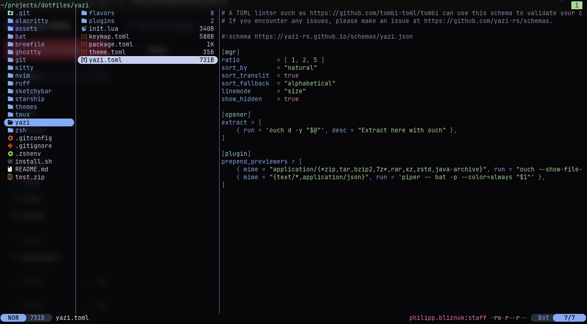
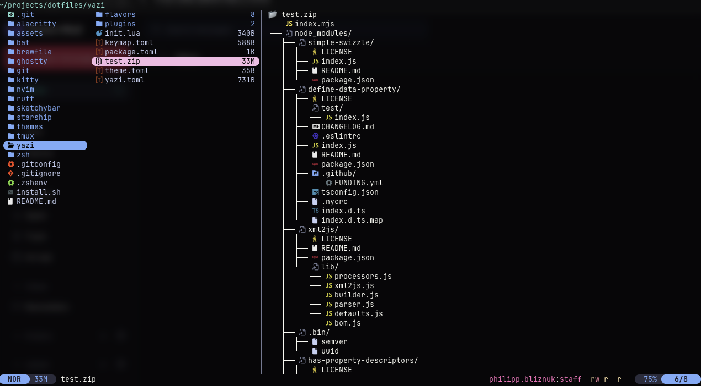

# Yazi Configuration

A minimal [Yazi](https://yazi-rs.github.io) file manager setup with sensible
defaults and consistent theming that matches the rest of the dotfiles ecosystem.

## Philosophy

1. **Minimal customization** — only override what the defaults get wrong.
   No bloated plugin stacks or excessive keybind remapping.
2. **Unified theming** — yazi flavors match the global `THEME` variable,
   keeping visual consistency with zsh, fzf, bat, and other tools.
3. **bat for text previews** — routes through piper to avoid syntect background
   color artifacts while preserving syntax highlighting.
4. **ouch for archives** — single tool for preview, extraction, and compression.

## File Structure

```
~/.config/yazi/
  yazi.toml          Manager settings, opener overrides, previewer config
  keymap.toml        Custom keybindings
  theme.toml         Flavor selection (one line)
  init.lua           Status bar customization (uid:gid display)
  package.toml       Plugin/flavor dependency manifest
  plugins/
    ouch.yazi/       Archive preview + compression
    piper.yazi/      Generic command previewer (pipes bat output)
  flavors/
    catppuccin-mocha.yazi/
    dracula.yazi/
    nord.yazi/
    rose-pine.yazi/
    tokyo-night.yazi/
    gruvbox-dark.yazi/
    everforest-medium.yazi/
    kanagawa.yazi/
```

## Preview Strategy

| Content | Previewer | Details |
|---------|-----------|---------|
| Text, code, JSON, CSV, TOML, etc. | piper → bat | `bat -p --color=always` — no line numbers, no frame |
| Archives (zip, tar, 7z, rar, etc.) | ouch | Tree view with file icons |
| Images | Built-in | Sixel/Kitty/iTerm2 protocol |
| PDFs | Built-in | First page render |
| Directories | Built-in | File listing |

The piper+bat approach avoids yazi's built-in syntect renderer which shows
unwanted background highlights on certain syntax scopes. bat suppresses
background colors by default, giving clean output.





## Custom Keybindings

| Key | Action |
|-----|--------|
| `!` | Open `$SHELL` in current directory (blocking) |
| `C` | Compress selected files with ouch |
| `X` | Extract hovered archive here |
| `Esc` | Cancel input |

## Manager Settings

- **Ratio**: `1:2:5` — small parent, medium current, large preview
- **Sort**: natural ordering with transliteration fallback
- **Hidden files**: shown by default
- **Line mode**: file size

## Theming

Yazi uses flavors for UI theming. The active flavor is set in `theme.toml`:

```toml
[flavor]
dark = "catppuccin-mocha"
```

Available flavors: `catppuccin-mocha`, `dracula`, `nord`, `rose-pine`,
`tokyo-night`, `gruvbox-dark`, `everforest-medium`, `kanagawa`.

When running `./install.sh`, the flavor is automatically set to match the
global `THEME` variable. bat previews also follow the global theme via the
`BAT_THEME` environment variable exported in `.zshrc`.

## Status Bar

Custom `init.lua` adds `uid:gid` display (magenta) to the right side of the
status bar for unix systems.

## Plugin Management

Plugins and flavors are tracked in `package.toml` and physically committed to
the repo (symlinked to `~/.config/yazi/` by install script). To update:

```bash
cd ~/.config/yazi
ya pkg upgrade
```

## Dependencies

- `bat` — syntax-highlighted text preview
- `ouch` — archive list/extract/compress
- `yazi` — the file manager itself

All installed via Brewfile.
