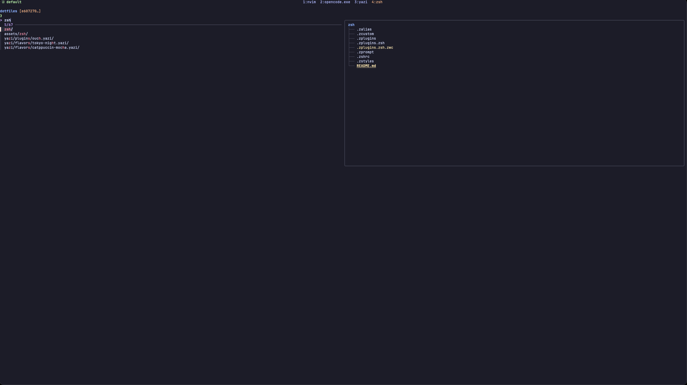
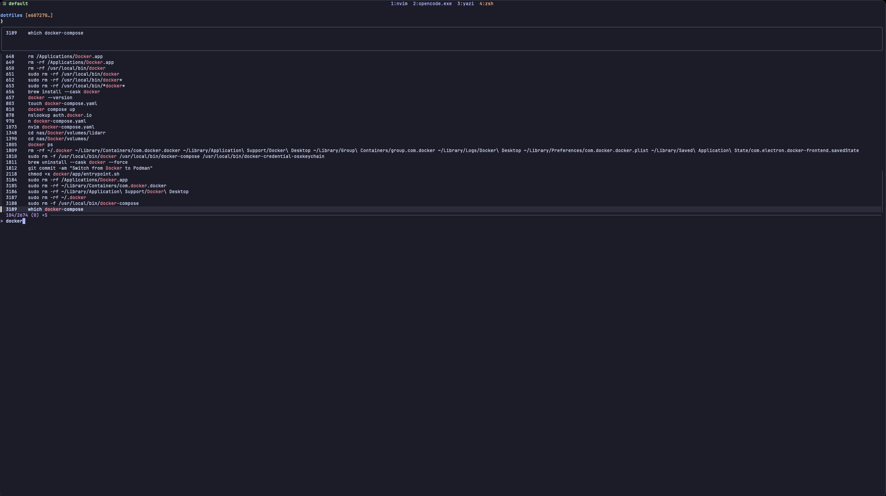
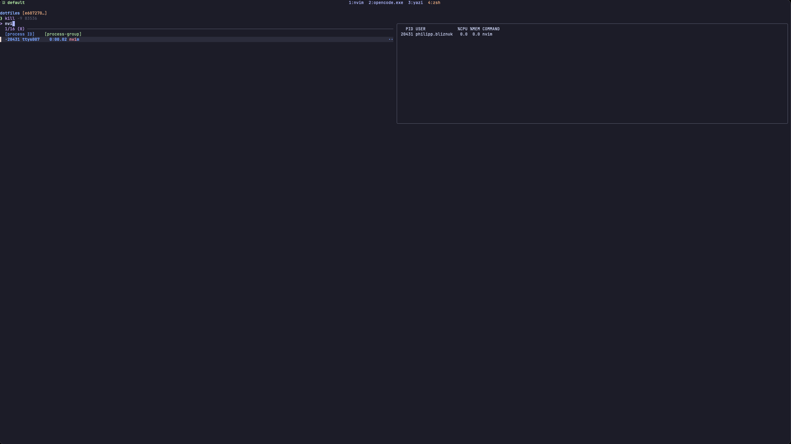
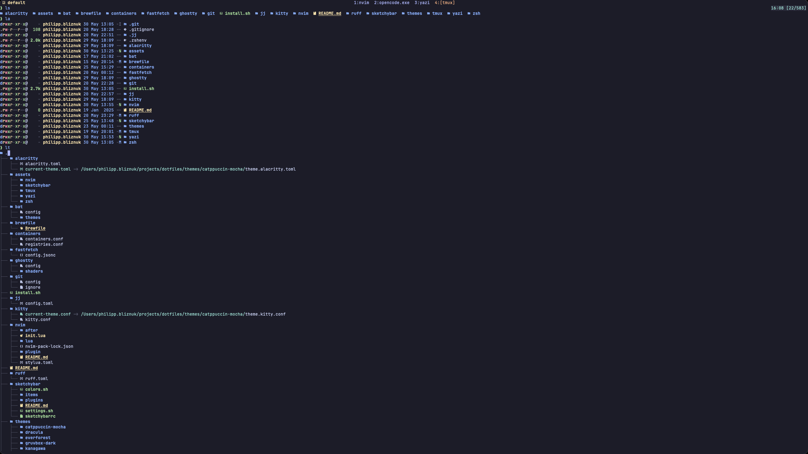

# Zsh Configuration

A performance-focused, XDG-compliant zsh setup built around the principle of
**minimal startup cost** without sacrificing functionality. Every millisecond
counts — the full init chain completes in ~60ms wall-clock time.

## Philosophy

1. **Speed first** — defer everything that isn't immediately visible. Plugins
   that don't affect the first prompt are loaded lazily after the first
   keypress.
2. **XDG compliance** — nothing lives in `$HOME` except `.zshenv`. All config,
   cache, data, and state follow XDG Base Directory specification.
3. **Single theme source** — one `THEME` variable in `.zshenv` controls the
   color palette for fzf, syntax highlighting, and any future tool.
4. **Static plugin loading** — plugins are bundled into a flat file at install
   time, not resolved on every shell start.
5. **No redundancy** — no duplicate PATH entries, no double-sourced files, no
   overlapping plugin features.

## File Structure

```
~/.zshenv                 Environment variables, XDG, PATH, theme selection
~/.config/zsh/
  .zshrc                  Main interactive config (history, plugins, theme, evalcache)
  .zstyles                Antidote config, completion styling, fzf-tab previews
  .zplugins               Plugin declarations (antidote source-of-truth)
  .zplugins.zsh           Auto-generated static plugin file (gitignored)
  .zalias                 Shell aliases
  .zcustom                Keybindings, FZF config, yazi wrapper, tmux auto-attach
```

## Startup Flow

```
.zshenv          XDG, ZDOTDIR, Homebrew (static), PATH, THEME
    |
.zshrc           GPG, history, fpath, zstyles, zvm_config
    |            antidote static load -> plugins sourced
    |            theme.zsh -> FZF colors from THEME_COLORS array
    |            evalcache: starship, fzf, zoxide (eager)
    |            deferred hook: uv, uvx, jj, podman (lazy, first keypress)
    |
.zcustom         zvm hooks, FZF walker opts, yazi, tmux
```

## Performance Strategy

| Technique                 | Savings     | Details                                                     |
| ------------------------- | ----------- | ----------------------------------------------------------- |
| Static plugin bundle      | ~50ms       | `antidote bundle` runs only when `.zplugins` changes        |
| evalcache                 | ~200ms cold | Caches `starship init`, `fzf --zsh`, `zoxide init` output   |
| Deferred completions      | ~120ms cold | uv/uvx/jj/podman load on first keypress, not startup        |
| Antidote zcompile         | ~5ms        | Pre-compiles plugin scripts to wordcode (`.zwc`)            |
| Plugin deferral           | ~30ms       | fzf-tab, F-Sy-H, autosuggestions load after prompt          |
| Static brew shellenv      | ~30-50ms    | Hardcoded Homebrew paths instead of `eval $(brew shellenv)` |
| `GPG_TTY=$TTY`            | ~3-5ms      | Zsh builtin instead of `$(tty)` subprocess                  |
| `(( ${+commands[...]} ))` | ~1ms        | Hash table lookup instead of `command -v` fork              |

**Benchmark results** (Apple Silicon, warm cache):

- Wall clock: ~60ms average
- zprof total: ~30ms function time
- Largest item: evalcache sourcing (28ms, unavoidable file reads)

## Plugin Stack

| Plugin                                                                                    | Role                                  | Loading               |
| ----------------------------------------------------------------------------------------- | ------------------------------------- | --------------------- |
| [evalcache](https://github.com/mroth/evalcache)                                           | Cache slow `eval "$(cmd)"` calls      | Eager                 |
| [ez-compinit](https://github.com/mattmc3/ez-compinit)                                     | Lazy compinit (once daily)            | Eager                 |
| [zsh-completions](https://github.com/zsh-users/zsh-completions)                           | Extra completion definitions          | fpath only            |
| [fzf-tab](https://github.com/Aloxaf/fzf-tab)                                              | Replace zsh menu with fzf             | Deferred              |
| [fast-syntax-highlighting](https://github.com/zdharma-continuum/fast-syntax-highlighting) | Syntax coloring with catppuccin theme | Deferred              |
| [zsh-autosuggestions](https://github.com/zsh-users/zsh-autosuggestions)                   | Fish-like inline suggestions          | Deferred              |
| [zsh-vi-mode](https://github.com/jeffreytse/zsh-vi-mode)                                  | Full vim keybindings                  | Eager (lazy keybinds) |

## Theming

A single environment variable controls the entire color scheme:

```bash
# .zshenv
export THEME="catppuccin-mocha"
```

Available themes: `catppuccin-mocha`, `dracula`, `nord`, `rose-pine`,
`tokyo-night`, `gruvbox-dark`, `everforest`, `kanagawa`.

Each theme provides:

- `theme.zsh` — `THEME_COLORS` associative array (26 semantic color keys)
- `theme.ini` — F-Sy-H INI for syntax highlighting

The `.zshrc` sources `theme.zsh` and builds FZF's `--color=` string dynamically
from `$THEME_COLORS`. Switching themes is a one-line change + `exec zsh`.


## Key Features

### Vim Mode with Custom Bindings

Full vi editing with `zsh-vi-mode` plus ergonomic additions:

**Insert mode** (`zvm_after_init`):

- Arrow up/down — prefix history search
- Ctrl+R — fzf fuzzy history
- Ctrl+T — fzf file picker
- Option+C (Mac `c`) — fzf cd

**Normal mode** (`zvm_after_lazy_keybindings`):

- `H`/`L` — beginning/end of line
- `Y` — yank to end of line
- `Ctrl+h`/`Ctrl+l` — word navigation
- `Ctrl+e` — edit command in `$EDITOR`
- `U` — redo

### FZF Integration (v0.48+ built-in walker)

No `FZF_DEFAULT_COMMAND` — uses fzf's native walker with `--walker-skip` for
excluded directories. Previews powered by `bat` (files) and `eza --tree`
(directories).

- `Ctrl+T` — file/dir picker with preview
- `Option+C` — cd with tree preview
- `Ctrl+R` — history with preview + Ctrl+Y to copy
- `**<TAB>` — fd-powered completion with context-aware previews





### fzf-tab Completion Previews

Tab completion is fully replaced by fzf with contextual previews:

- `cd <TAB>` — directory tree preview
- `kill <TAB>` — process info
- `export <TAB>` — variable value
- `Ctrl+h`/`Ctrl+l` — switch completion groups



### Tmux Auto-Attach

Every new terminal automatically attaches to the `default` tmux session (or
creates it). Combined with `tmux-resurrect` (`@resurrect-processes 'false'`),
restored panes spawn fresh shells that go through the full init chain.

### Yazi Shell Integration

`y` function launches yazi and `cd`s into the last active directory on exit.

### Tiered `ls` Aliases (eza)

- `ls` — compact with color + icons
- `ll` — long format with git status
- `la` — long + hidden files
- `lt` — tree view (2 levels)



## Dependencies

Core tools (installed via Brewfile):

- `fzf` — fuzzy finder
- `fd` — file finder (for `**` completions)
- `eza` — modern ls replacement
- `bat` — syntax-highlighted file preview
- `zoxide` — smart cd
- `starship` — prompt
- `neovim` — editor
- `yazi` — terminal file manager
- `tmux` — terminal multiplexer

## Adding a New Theme

1. Create `themes/<name>/theme.zsh` with `typeset -gA THEME_COLORS=(...)`
   using the same 26 keys as existing themes
2. Create `themes/<name>/theme.ini` for F-Sy-H syntax colors
3. Set `THEME="<name>"` in `.zshenv`
4. `exec zsh`
